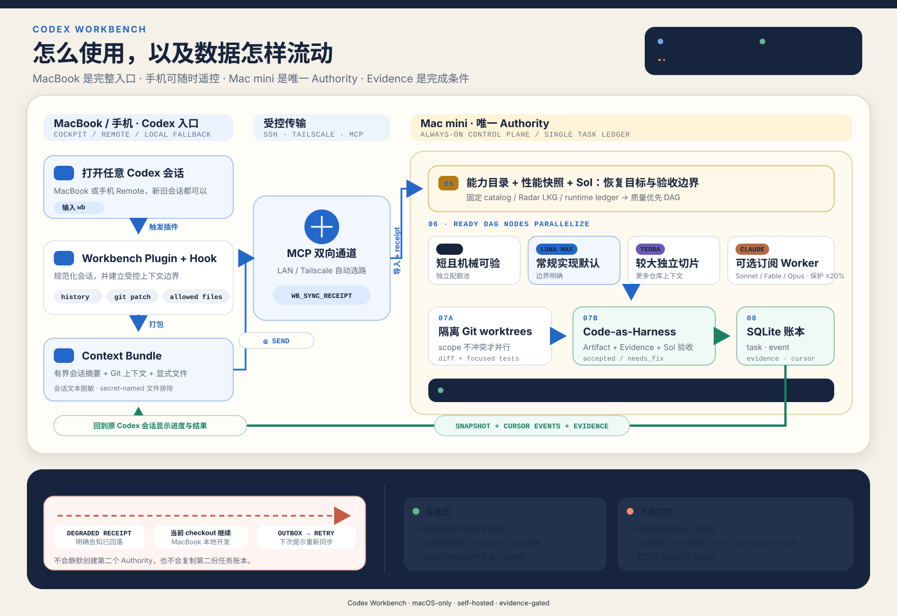

# Codex Workbench

> A self-hosted, macOS-only control plane for durable, evidence-gated AI development.
>
> 将一台常驻 Mac mini 变成唯一的开发权威端，把 MacBook 上的 Codex 变成随时可接续的驾驶舱。

Codex Workbench 是面向拥有一台长期运行 Mac mini 与一台 MacBook 的技术操作者或小团队的可复用自托管开发控制面：它把一个自然语言目标编译为有范围、有依赖、有验收条件的任务图（DAG），在隔离 Git worktree 中并行执行，并且只有独立验收者确认了可复查的 Evidence 后，任务才会进入 `accepted`。

它适合已经有一台可长期运行的 Mac mini、主要在 MacBook 上使用 Codex、并希望把 Claude Code 订阅作为受控后台算力的人。它不是云端 SaaS，不是通用的“一键式 Codex 插件”，也不依赖或管理 DSH、Solar 或 AI4Research。



## 它解决什么问题

日常 AI 开发很容易在设备切换、网络中断、并行写冲突、重复测试和配额透支中失去上下文。Workbench 将这些问题变成可执行的系统约束：

| 问题 | Workbench 的做法 |
| --- | --- |
| MacBook 合盖或网络中断后，任务难以接续 | Mac mini 是唯一的持久 Authority；MacBook 只消费同一份状态。已绑定会话失联时明确回退本地 checkout，并保留可重试的 outbox。 |
| 多个 Agent 同时改代码互相踩踏 | DAG 只并行运行无依赖、作用域不冲突的节点；每个 Worker 使用独立分支和 Git worktree。 |
| “Worker 跑完了”被误当作完成 | Worker 结果不是验收。只有独立 verifier 收齐约定的 diff、检查日志和 verdict 后，任务才可 `accepted`。 |
| 强模型被实现细节占满 | Sol 负责需求编译、跨模块判断和最终验收；边界明确的实现优先交给 Spark、Luna、Terra 或受配额约束的 Claude Worker。 |
| Claude Code 订阅被后台任务耗尽 | Claude Worker 只在认证和新鲜配额快照可证明时启用；未知状态会 fail closed 并转交 Codex。系统保留至少 20% 的目标配额空间，并设有更早的调度门槛。 |
| 验证反复运行、成本高且结论不清 | `code-as-harness/v1` 将 L0–L3 验证层级和 Evidence fingerprint 写入任务契约；相同输入闭包的已通过证据可复用。 |

## 运行模型

```text
                           Codex conversation on MacBook
                                      │
                        `wb` plugin / Codex MCP binding
                                      │
                                      ▼
┌────────────────────────────────────────────────────────────────────┐
│ Mac mini Authority                                                   │
│                                                                    │
│  SQLite task ledger ──► Sol planner ──► scope-aware parallel DAG   │
│         │                       │                                  │
│         │                       ├── Codex Spark / Luna / Terra     │
│         │                       ├── optional Claude Code workers   │
│         │                       └── deterministic build/test tools │
│         │                                                          │
│         └──► independent Sol verifier ──► Evidence ──► accepted   │
└────────────────────────────────────────────────────────────────────┘
                                      │
                           snapshots + cursor events
                                      │
                                      ▼
                         MacBook cockpit / local fallback
```

### 核心组件

- **Mac mini Authority**：唯一的 SQLite 写入者、任务账本、协调器、ArtifactStore 和后台执行位置。它可通过 `launchd` 常驻运行；其他设备不会创建第二个协调器或复制第二份账本。
- **MacBook cockpit**：Codex 的 MCP 入口、状态面板和控制端。它读取 Authority 的 snapshot + cursor events，可调整优先级、追加 steering、查看 Evidence 和做受契约约束的控制操作。
- **`wb` Codex 入口**：一个薄插件，将新会话或已有会话绑定到同一份持久任务。它同步经脱敏的会话摘要与受控 Git 上下文，而不持有第二份任务状态。
- **Claude Code Worker**：可选的订阅型执行器，不承担规划或最终验收。认证、CLI 兼容性或配额状态不明确时不会猜测余额，也不会使用 API-key fallback。
- **离线回落**：如果 Authority 不可达，已绑定会话继续在 MacBook 当前 checkout 上工作；系统不会在离线端静默创建第二个 Authority，下一次可用连接再重试同步。

## 核心能力与边界

### 并行但不失控

任务首先由 Sol 规划器编译为持久 TaskContract 和 DAG。只有依赖已完成且读写 scope 不冲突的节点才会并行；父子路径互斥，纯读节点可以并行。每个执行节点在独立 worktree/branch 中运行，因此并行提升吞吐量而不会把共享工作树变成竞态源。

路由不是固定“弱模型干活”的盲目规则：低风险、短且可机械验收的工作可进入独立 Spark 池；边界明确的常规实现优先 Luna；较大的独立切片可以升级 Terra；需求拆解、跨模块判断和最终验收留给 Sol。Claude Code 的 Sonnet、Opus 或 Fable 只在其订阅资格和受保护配额可证明时作为 Worker 使用。

### Code-as-Harness：把开发规则变成可验证契约

Workbench 将 `code-as-harness/v1` 投影到 Codex 与 Claude Code 的受控路径，并把验证层级、作用域、并行策略和 Evidence reuse 规则记录到每个任务契约中。

- `L0`：只读或文档变更，检查相关内容与 diff。
- `L1`：局部改动，运行一个能证伪改动的聚焦检查。
- `L2`：跨文件或共享接口，运行受影响测试与必要的构建/类型检查。
- `L3`：发布、迁移、持久化或显式全量验收，稳定后运行一次项目要求的完整门禁。

这不是对外部平台插件执行状态的宣称。`harness health` 只报告它实际观察到的二进制、Skill、策略块和受控注入状态；不会把文件存在误写成模型调用或登录成功。

### Research 与 Archify：需要时强制，但不把工具当真相

- **Research**：规划器会为架构/探索、高复杂度决策、论文与上游复现、选型迁移、性能基准、兼容性或安全等场景注入 Research 工作流。普通、边界明确的实现不会被迫做研究；深度并行研究需要明确请求。
- **Archify**：仓库固定携带 Archify 的 stable core，并把它用于架构、设计、审核和需求类任务的 typed JSON IR、渲染与 receipt。渲染/Schema 通过只证明工件约束通过，不证明架构事实、运行时因果或推理质量；语义和视觉结论仍需要外部或人工 Evidence。

详情请见 [原设计忠实度矩阵](docs/fidelity-matrix.md) 与 [Archify 集成保真矩阵](docs/archify-fidelity-matrix.md)。

### Claude 配额保护

Claude 没有被当作无限资源。Workbench 以被动方式读取兼容的本地订阅用量显示；当认证、版本、用量格式或快照新鲜度无法证明时，Claude 调度会关闭并由 Codex 接管。

| 配额状态 | 调度行为 |
| --- | --- |
| 余额充足 | 在共享并发限制内使用合适的 Claude Worker。 |
| 接近保留阈值 | 限制可用模型与并发，优先保留可预测的剩余额度。 |
| 保护区、未知或认证失败 | 不启动新的 Claude Worker；同一 attempt 转交 Codex，不循环重登。 |

20% 是持续保留目标；30% 是新任务 admission guard，25% 是硬停线。由于上游 CLI 暴露的是显示文本而非可强制消费上限，系统不会声称能从代码层面保证单次模型回合绝不越线。有关可证明边界，见 [忠实度矩阵](docs/fidelity-matrix.md)。

## 快速开始

> Workbench 当前面向熟悉 macOS、SSH、Git 与 Codex 的操作者。请先阅读完整的 [AI 安装与配置指南](docs/AI_INSTALL.md)，再让 AI 或人工执行安装步骤。

### 前提条件

- 一台可常驻运行的 **Mac mini**（Authority）和一台 **MacBook**（cockpit），均为 macOS。
- Python 3.11+、Git、已认证的 Codex CLI；Claude Code 是可选项。
- MacBook 到 Mac mini 的 SSH 连通性；使用远程 cockpit 时推荐 Tailscale。
- Node.js 18+（仅在需要 Archify 渲染/验证时）。
- 已阅读并接受：这是需要由操作者维护的自托管开发控制面，不是多租户托管服务。

当前完整安装方式是从受信任的 Git tag 或提交检出源码后运行仓库安装器。Python wheel/sdist 尚不包含 Archify、Skills、安装脚本和 launchd 资源，因此不要用 `pip install codex-workbench` 代替本指南的源码安装流程。

### 最小安装路径

在两台机器上检出同一受信任版本的源码。先在 Authority 上执行 dry-run；它不会写入文件、启动服务、连接 SSH 或注册 MCP。

```bash
git clone <repository-url> codex-workbench
cd codex-workbench

# Mac mini: inspect the Authority installation plan first
scripts/python-runtime scripts/install-macos.py --dry-run
```

确认计划和本机前提条件后，按照 [AI 安装与配置指南](docs/AI_INSTALL.md) 在 Mac mini 安装 Authority，并在 MacBook 安装 cockpit/MCP：

```bash
# MacBook: inspect the client plan first
scripts/python-runtime scripts/install-macbook-client.py \
  --authority-ssh-alias <authority-host> \
  --authority-lan-host <HOME_LAN_HOST> \
  --authority-lan-port <HOME_LAN_SSH_PORT> \
  --authority-tailnet-host <TAILNET_HOST> \
  --home-network <HOME_CIDR> \
  --home-network <HOME_CIDR_BACKUP> \
  --ssh-transport location-aware \
  --dry-run
```

Authority 安装器不会创建全局 PATH 链接。安装后用实际运行目录中的二进制进行最小健康检查：

```bash
export WB_STATE_ROOT="$HOME/Library/Application Support/Codex Workbench"
export WB_AUTHORITY_BIN="$WB_STATE_ROOT/app/bin/codex-workbench"
"$WB_AUTHORITY_BIN" --home "$WB_STATE_ROOT" doctor
"$WB_AUTHORITY_BIN" --home "$WB_STATE_ROOT" harness health
codex mcp get codex-workbench
```

### 从 Codex 会话进入

安装并信任 `wb` 插件后，在新会话或已有会话中输入：

```text
wb
```

插件会请求将当前会话与受控代码上下文绑定到 Mac mini Authority。安装或 Hook 内容变更后，Codex 需要用户在 `/hooks` 中审核该 Hook；这是 Codex 的显式信任步骤，不会被 Workbench 绕过。

`wb` 插件随仓库内的 [`.agents/plugins/marketplace.json`](.agents/plugins/marketplace.json) 与 [`plugins/codex-workbench/`](plugins/codex-workbench/) 发行，可通过 Codex Marketplace 安装。首次使用仍需显式添加该 Marketplace source、安装插件并审核 Hook；这不是无需确认的一键启用。完整的安装、升级与回退方式以 [AI 安装与配置指南](docs/AI_INSTALL.md) 为准。部分 Codex 版本不接受自定义顶层 `/WB`，因此默认入口是小写的 `wb`；`$WB` 和从 `/skills` 选择 `WB` 也可作为替代入口。

如果在家网段且 MCP 链路可达，客户端会优先走家庭 LAN；否则回落到 Tailscale 原生 SSH TCP Serve（默认端口 10022）。判断失败后会产生 `degraded` receipt 并走 outbox，下一次同一会话重试 `wb` 时继续同步。该策略不是按国家/区域判断，不会修改系统网络与 Tailscale 配置，也不会自动发起登录。

## 一次任务会怎样流转

```text
natural-language objective
        │
        ▼
Sol planner ──► TaskContract + scope-aware DAG
        │
        ├── independent nodes run in isolated worktrees
        │       ├── deterministic checks
        │       ├── Codex workers
        │       └── optional Claude Code workers (quota-gated)
        ▼
independent Sol verifier
        │
        ├── accepted: required diff, checks, verdict and Evidence agree
        └── needs_fix / needs_approval / blocked: durable state, not a hidden retry
```

示例：从命令行提交一个边界明确的任务。将 scope 和验收命令替换为你的仓库实际边界。

```bash
codex-workbench request \
  "修复解析器并补齐回归测试" \
  --repository "$PWD" \
  --allowed-scope src/parser \
  --allowed-scope tests/parser \
  --acceptance-command "python -m unittest tests.test_parser" \
  --task-type debugging \
  --complexity standard \
  --verification-tier L2 \
  --queue
```

## CLI 参考

<details>
<summary>展开查看常用命令</summary>

```bash
# Authority lifecycle and non-model health checks
codex-workbench init --authority
codex-workbench serve
codex-workbench doctor
codex-workbench doctor --require-restart-ready
codex-workbench harness health

# Tasks, events and durable approvals
codex-workbench task list
codex-workbench task get <task-id>
codex-workbench events --task-id <task-id>
codex-workbench approval list
codex-workbench task steer <task-id> "<next-attempt instruction>" --expected-revision <n>
codex-workbench task priority <task-id> <priority> --expected-revision <n>

# Acceptance, routing and quota observation
codex-workbench acceptance
codex-workbench quota show

# Source synchronization and explicitly authorized GitHub delivery
codex-workbench sync github --repository <repository-path> --branch <branch>
codex-workbench deliver <task-id> --base-branch <branch>
```

`deliver` 只会处理契约中明确允许外部写入、且已经由 verifier 接受的任务。网络不确定时会记录 `indeterminate`，而不是猜测重放写操作。

</details>

## 隐私、网络与运行边界

- Workbench 是可复用的自托管开发控制面；仓库源码不包含运行账本、会话、认证文件、配额快照或控制令牌。
- 受控执行器使用既有的 Codex/Claude 原生订阅登录态；不读取或转发 `OPENAI_API_KEY`、`ANTHROPIC_API_KEY`，也不以 API key 作为订阅失败的回退。
- Authority 默认只监听本机回环地址。远程 cockpit 通过你配置的 SSH/Tailscale 通道访问，而不是把 SQLite 服务公开到互联网。
- MacBook 和离线端不创建第二个 Authority；它们只能读取、控制或准备后续同步。
- 该项目仅支持 macOS；手机真机接入和页面关闭后的 Push 目前在 [backlog](docs/backlog.md) 中，不应被视为已交付能力。

## 状态与文档

当前源码版本为 `1.5.0`。这是一个正在演进的自托管系统：实现、自动化测试与外部真实旅程的验收状态被有意区分。请不要将 fixture、静态健康检查或单次进程启动当作生产端到端证明。

- [AI 安装与配置指南](docs/AI_INSTALL.md) — 面向 AI 操作者和人工复核者的部署、连接、回退与验收步骤。
- [原设计忠实度矩阵](docs/fidelity-matrix.md) — 已实现、部分实现和需真实外部 Evidence 的边界。
- [Archify 集成保真矩阵](docs/archify-fidelity-matrix.md) — 上游来源、适配范围及不可夸大的结论。
- [Backlog](docs/backlog.md) — 已明确后置的手机接入与通知工作。

## 项目边界

Codex Workbench 是独立项目：它不属于 DSH、Solar 或 AI4Research，也不要求这些项目存在或运行。其目标不是替代你的编辑器、Git 平台或 Agent 工具，而是为它们之间的长期任务、模型路由、并行执行、配额保护和验收 Evidence 提供一个可恢复的控制面。
